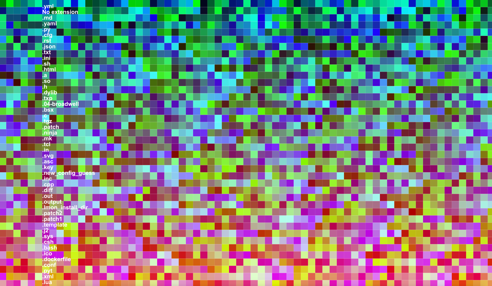

# Code Art

[](https://pypi.org/project/codeart/)
[](https://github.com/vsoch/codeart/actions?query=branch%3Amaster+workflow%3Aci)

I wanted a way to culminate the last decade of programming that I've done, and realized
it would be much more fun to create a tool that others could use as well. Specifically, I want to be able to:

 1. Have a class that parses over repos on my local machine, and organizes files based on extension..
 2. Builds a word2vec model, one per extension, the idea being that each language has it's own model. The word2vec model should have three dimensions so that we can map it to an RGB colorspace. This will mean that the embeddings for each character, along with being unique for the language, will also have a unique color. We should also be able to build one model across extensions, and map each extension to it.
 3. At the end, I should be able to visualize any particular script (or some other graphic) using these embeddings. I'd like to add in some variable / dimension to represent age / date too.

## Progress

What I have so far is an ability to do the above, and then to produce a tiny image for
each code file, where the words are colored by their word2vec (3 dimensional, RGB) embedding. Here
is a small example of a Python script from spack:


And here is a randomly placed grid with all python files from the spack repository:


And see [Example 5: Generate a Color Map](#example-5-generate-a-color-map) for a more organized rendering of just the color space.
What I'm working towards is being able to derive and organize the above images as well,
possibly based on an average color or similar.

## Usage

### Install

You can install from pypi

```bash
pip install codeart
```

or install from the repository directly:

```bash
$ git clone https://github.com/vsoch/codeart
$ python setup.py install
```

The following examples are also provided in the [codeart examples](https://github.com/vsoch/codeart-examples) repository.

### Example 1: Galleries and Interactive Visualizations

#### Generate an Abstract Gallery

You can generate a web gallery for a root folder (including all files beneath it) or
a repository:

```python
from codeart.main import CodeBase                                       
code = CodeBase()                                                       

# How to add a folder
code.add_folder('/home/vanessa/code')  

# How to add a repository
code.add_repo("https://github.com/spack/spack")

# See languages with >100 files
code.threshold_files(100)

# Generate a web report (one page per language above this threshold)
gallery = code.make_gallery(groups=['', '.py', '.patch']) 
Training model with groups |.py|.patch
Generating web output for ''
Generating web output for '.py'
Generating web output for '.patch'
Finished web files are in /tmp/code-art-xp73v5ji
```

And then the example files for each of:

 - [all](https://vsoch.github.io/codeart-examples/parse_repo/codeartall.html)
 - [python](https://vsoch.github.io/codeart-examples/parse_repo/codeart.py.html)
 - [patch](https://vsoch.github.io/codeart-examples/parse_repo/codeart.patch.html)
 - [empty space](https://vsoch.github.io/codeart-examples/parse_repo/codeart.html)

You can also browse raw images [here](https://github.com/vsoch/codeart-examples/tree/master/parse_repo/images).

### Generate RGB Vectors

If you want to generate RGB vectors for a code base, you can use these
for your own machine learning projects. Here is how to do that
for a repository.

```python
from codeart.main import CodeBase

code = CodeBase()
code.add_repo("https://github.com/spack/spack")
```

The codebase will have codefiles added, a lookup in code.codefiles for each
extension found. You'll want to take a look at these and choose some subset above
a given threshold.

```python
# Look at extractors, one added per extension
code.codefiles

# Find those with >100 files
code.threshold_files(thresh=100)

# {'': [codeart-files:115],
# '.py': [codeart-files:4227],
# '.patch': [codeart-files:531]}
```

And then train a word2vec model, one for each group / extension, with size of 3
so that we can map to the RGB colorspace.

```python
code.train(groups=['.py', '', '.patch'])
```

You can also train a single model for those extensions

```python
code.train_all(groups=['.py', '', '.patch'])
```

Or train using all groups.

```python
code.train_all()
```

We now have a model for each extension (and all)

```python
code.models
code.models['all']
```

Here is how to get a panda frame for a particular extension (or all)

```python
vectors = code.get_vectors(".py")
vectors = code.get_vectors("all")
```

#### Generate Interactive Colormap

Let's say that we extracted the spack codebase (shown above) and then
wanted to visualize the vectors. What do I mean? I want to see how the
terms that are part of the embeddings model (each corresponding to
a word/term found in a code file with some extension) correspond to each
extension. To do this, I can extract counts and vectors:

```python
from codeart.graphics import generate_interactive_colormap

vectors = code.get_vectors('all')
counts = code.get_color_percentages(groups=list(code.codefiles.keys()), vectors=vectors)

# Save if desired!
vectors.to_csv("spack-colormap-vectors.csv")
counts.to_csv("spack-color-percentages.csv")

tmpdir = generate_interactive_colormap(vectors=vectors, counts=counts, width=1000)
```

The early interactive version is [here](https://vsoch.github.io/codeart-examples/parse_repo/web/)
and this was updated to be better sorted, seen [here](https://vsoch.github.io/codeart-examples/parse_repo/sorted/).
Basically, each term in the model is represented with its color, and the color transparency
is based on the prevalence of each term for any given extension. You can click on a
different extension to see the colors change.



For the second plot (sorted) since the color RGB values are sorted based on similarity,
you can also deduce that similar colors indicate similar terms, which indicates similar
context in the code files.

### Example 2: Generate a Plot

You might just want to get vectors and plot the RGB space. You can do:

```python
import matplotlib.pyplot as plt
from mpl_toolkits.mplot3d import Axes3D

fig = plt.figure()
ax = Axes3D(fig)
ax.scatter(vectors[0].tolist(), vectors[1].tolist(), vectors[2].tolist(), c=vectors.to_numpy()/255)

# Optionally add text (a bit crowded)
for row in vectors.iterrows():
    ax.text(row[1][0], row[1][1], row[1][2], row[0])

plt.show()
plt.savefig("img/spack-python.png")
```

### Example 3: Generate Code Images

If you want to generate raw images for some extension, you can do that too.
These can be used in some image processing project, to generate other images,
or some other kind of clustering analysis.

```python
# Generate images for all files
if not os.path.exists('images'):
    os.mkdir('images')

# Create folder of code images (if you want to work with them directly)
code.make_art(extension=".py", outdir='images', vectors=vectors)
```

### Example 4: Generate a Color Lookup Grid

I haven't developed this in detail, but you can also generate a grid of colors
for a given image. The idea here would be to have a grid that
can be used as a legend. Here we again load in the spack code base,
and generate a lookup for the ".py" (python) extension.

```python
from codeart.main import CodeBase
from codeart.graphics import save_vectors_gradient_grid
code = CodeBase()                      
code.add_repo("https://github.com/spack/spack")
vectors = code.get_vectors(".py")
save_vectors_gradient_grid(vectors=vectors, outfile='spack-image-gradient.png') 
```

An example gradient image is the following:


And a much larger one (you'll need to click and zoom in):


which is generated from [this data](https://github.com/vsoch/codeart-examples/blob/master/parse_folders/vectors-gradients.tsv) that I created by building a model across all the Python code on my computer (note there are many different
file extensions in the model beyond Python!).

You can of course adjust the dimensions, the row height, and the column width
and font size depending on your needs or matrix size.

### Example 5: Generate a Color Map

You can [follow this notebook](https://github.com/vsoch/codeart-examples/blob/master/derive_colormap/derive_colormap.ipynb)
to see how you might generate a colormap. For example, here is an entire colormap for my Python (and associated files)
code base, without altering opacity, but just plotting the colors (these are the colors
that align with the color lookup grid above).


And if we do dimensionality reduction, we can plot this in 2d:


And finally, we can assess counts for any particular extension across
the codebase to derive images that use transparency to show the prevalence of any given term.
Here is for .yml and .rst (restructured syntax) files.


We can also generate an animation to loop through each language.


But note that this data would benefit greatly from interactive visualization,
akin to the [interactive colormap example](#generate-interactive-colormap)
example mentioned previously.

### Example 6: Parse Folders by a Custom Function

You might want to organize groups in some logical way that goes beyond an extension,
or just using all files. For this reason, each of the functions add_folder, and add_repo
can be given a custom "func" that will return a group name based on a file.
For example, from [utils](codeart/utils.py) we can import a function that will
group files by year:

```python
def group_by_year_created(filename):
    """Given a filename, return the year it was created.
       This function is called after testing the file for read access. 
    """
    stat = os.stat(filename)
    return datetime.fromtimestamp(stat.st_ctime).year
```

And then when adding a folder or repo, we might do:

```python
code.add_folder(folder, func=group_by_year_created)
code.add_repo(folder, func=group_by_year_created)
```

You can also just provide a string or group directly (takes preference over func):

```python
code.add_repo(repo, group="2017")
```

The function you provide should take the file name as the main argument.
A more complex example (parsing GitHub repos by creation date using the GitHub
API) is provided at [parse_by_year.py](https://github.com/vsoch/codeart-examples/blob/master/parse_by_year/parse_by_year.py).

## Example 7: Generate CodeArt Text

A simple use case is to, given a repository or folder, generate a text image using it.

```python
from codeart.graphics import generate_codeart_text
from codeart.colors import generate_color_lookup

# either works here
code.add_repo("https://github.com/vsoch/codeart")
code.add_folder("/path/to/folder")

images = code.make_art(group="all", outdir=os.getcwd())
images = glob("%s/*" % os.path.join(os.getcwd(), "images"))
color_lookup = generate_color_lookup(images)

# Generate an image with text (dinosaur!)
generate_codeart_text("dinosaur", color_lookup, outfile="index.html")
```

A similar function (not as well used / developed) is to generate a mapping
to an image.

```python
from codeart.graphics import generate_codeart
generate_codeart('sunset.jpg', color_lookup, sample=10, top=100, outfile="index.html")
```

For more details on text generation, see the


## Example 8: Basic Client Usage

For the text generation, I've created a simple client that will drive the interaction:

```bash
> codeart --help
usage: codeart [-h] [--version] {textart} ...

Code Art Generator

optional arguments:
  -h, --help  show this help message and exit
  --version   print the version and exit.

actions:
  actions for Code Art generator

  {textart}   codeart actions
    textart   extract images from GitHub or local file system.
```

Currently the only simple command is to generate a code art text graphic. 
Be aware that this generates one image per code file, and should be done
for small code bases, or larger ones with caution.

```bash
codeart textart --help
usage: codeart textart [-h] [--github GITHUB] [--root ROOT] [--outdir OUTDIR]
                       [--text TEXT]

optional arguments:
  -h, --help       show this help message and exit
  --github GITHUB  GitHub username to download repositories for.
  --root ROOT      root directory to parse for files.
  --outdir OUTDIR  output directory to extract images (defaults to temporary
                   directory)
```

For an example, you can see the .github actions workflow in [codeart-examples](https://github.com/vsoch/codeart-examples).


Do you have a question? Or want to suggest a feature to make it better?
Please [open an issue!](https://www.github.com/vsoch/codeart)
